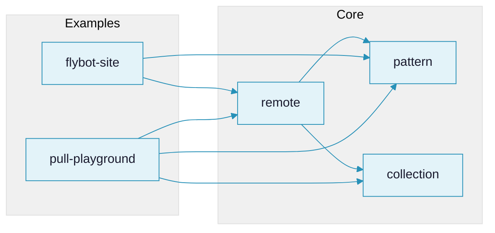

#  Lasagna Pattern

A monorepo for pull-based pattern matching and data transformation in Clojure/ClojureScript.

*Why "lasagna"? Three layers that stack: **pattern** matches your data, **collection** stores it, **remote** sends it over the wire. Use one, two, or all three.*

## Rationale

Traditional data access requires writing custom traversal code for each query shape. This toolbox provides a **declarative pattern language** inspired by Datomic pull and GraphQL, but designed for Clojure data:

- **Patterns as data** - Queries are EDN, not strings or macros
- **Bidirectional** - Same patterns for reading and writing (CRUD)
- **Composable** - Build complex queries from simple primitives
- **Cross-platform** - Works in Clojure and ClojureScript

## Try It

Explore the pattern syntax interactively at [pattern.flybot.sg](https://pattern.flybot.sg) — no setup required. Write patterns, see results instantly, and work through progressively structured examples covering bindings, collections, sequences, constraints, and mutations.

## Architecture



*`pattern` and `collection` are independent foundations; `remote` builds on both*

## Components

| Component | Description |
|-----------|-------------|
| [pattern](./pattern) | Core pattern DSL for matching and transforming data |
| [collection](./collection) | CRUD collection abstraction with DataSource protocol |
| [remote](./remote) | Remote protocol (GraphQL-like) using pattern language |
| [flybot-site](./examples/flybot-site) | Production blog demonstrating pull pattern in web development |
| [pull-playground](./examples/pull-playground) | Interactive browser playground |

## Workspace Structure

```
lasagna-pattern/
├── pattern/              # Core pattern DSL
├── collection/           # CRUD collection abstraction
├── remote/               # HTTP transport layer
├── examples/
│   ├── flybot-site/      # Production blog example
│   └── pull-playground/  # Interactive playground
├── claude-ctx/           # Optional LLM plugins
└── bb.edn                # Monorepo task runner
```

## Pattern Syntax

```clojure
?x                    ; Bind value to x
?_                    ; Wildcard (match anything)
{:key ?v}             ; Map pattern
[?first ?rest*]       ; Sequence with rest
(?x :when pred)       ; Constrained match
(?x :default val)     ; Default on failure
{{:id 1} ?result}     ; Indexed lookup
$                     ; Original input (in body)
```

## Getting Started

### Prerequisites

- [Babashka](https://github.com/babashka/babashka) (for task running)
- [Clojure CLI](https://clojure.org/guides/install_clojure) 1.11+
- Java 11+ (17 or 21 recommended)
- Node.js 18+ (for ClojureScript examples)

### Quick Start

```bash
bb list                        # List all components
bb dev examples/flybot-site    # Start REPL for component
```

## Tasks

All tasks are run from the repository root.

| Task | Description |
|------|-------------|
| `bb list` | List all components |
| `bb rct` | Run RCT tests for **all** components |
| `bb rct <component>` | Run RCT tests for a specific component |
| `bb test` | Run Kaocha tests for **all** components (includes RCT + integration tests) |
| `bb test <component>` | Run Kaocha tests for a specific component |
| `bb dev <component>` | Start REPL with dev config |
| `bb nrepl <component>` | Start nREPL server |
| `bb clean` | Clean build artifacts for all components |
| `bb clean <component>` | Clean build artifacts for a specific component |
| `bb serve <component>` | Serve static UI (if component supports it) |
| `bb server <component>` | Start backend server (if component supports it) |

### Testing

Each component has **Rich Comment Tests (RCT)** embedded in source files. Some components also have **Kaocha test suites** that include RCT plus additional integration tests.

- `bb rct` - Fast feedback, runs only RCT assertions
- `bb test` - Full test suite via Kaocha (RCT + integration tests)

## LLM Tooling

Optional Claude Code plugins are available in `claude-ctx/` for enforced workflows:

```bash
/plugin marketplace add ./claude-ctx
```

| Plugin | Description |
|--------|-------------|
| `lasagna-clj` | Clojure conventions, paren repair |
| `lasagna-jj` | jj-only workflow (blocks git), test reminders |

You are of course free to use the context enhancing and LLM you like.

## License

[UNLICENSE](./UNLICENSE) - Public domain.
