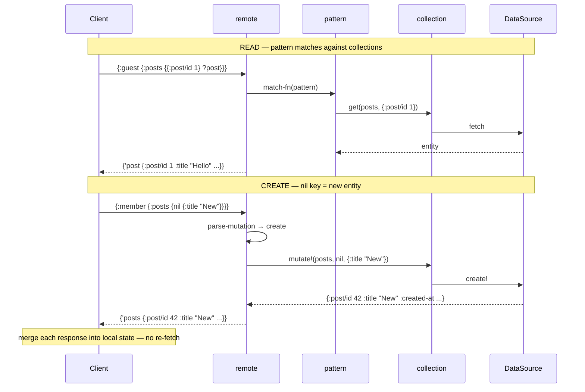

#  Lasagna Pattern

[](https://clojars.org/sg.flybot/lasagna-pattern)
[](https://clojars.org/sg.flybot/lasagna-collection)
[](https://clojars.org/sg.flybot/lasagna-remote)


A monorepo for pull-based pattern matching and data transformation in Clojure/ClojureScript.

*Why "lasagna"? Three layers that stack: **pattern** matches your data, **collection** stores it, **remote** sends it over the wire. Use one, two, or all three.*

## Rationale

Traditional data access requires writing custom traversal code for each query shape. This toolbox provides a **declarative pattern language** inspired by Datomic pull and GraphQL, but designed for Clojure data:

- **Patterns as data** - Queries are EDN, not strings or macros
- **Bidirectional** - Same patterns for reading and writing (CRUD)
- **Composable** - Build complex queries from simple primitives
- **Cross-platform** - Works in Clojure and ClojureScript

## Try It

Explore the pattern syntax interactively at [pattern.flybot.sg](https://pattern.flybot.sg) — no setup required. Write patterns, see results instantly, and work through progressively structured examples covering bindings, collections, sequences, constraints, and mutations.

Switch to **Remote mode** to pull live data from [flybot.sg](https://www.flybot.sg) — the same patterns query real blog posts, demonstrating role-based access, schema validation, and autocomplete against a production API. You can also point it at your own pull-compatible server.

## Installation

Each component is published independently to Clojars:

```clojure
;; deps.edn — pick the layer you need
{:deps
 {sg.flybot/lasagna-pattern    {:mvn/version "0.1.0"}   ;; pattern only
  sg.flybot/lasagna-collection {:mvn/version "0.1.0"}   ;; + CRUD collections
  sg.flybot/lasagna-remote     {:mvn/version "0.1.0"}}} ;; + HTTP transport
```

| Artifact | What you get |
|----------|--------------|
| [`sg.flybot/lasagna-pattern`](https://clojars.org/sg.flybot/lasagna-pattern) | Core pattern DSL — matching and transforming data |
| [`sg.flybot/lasagna-collection`](https://clojars.org/sg.flybot/lasagna-collection) | CRUD abstraction with DataSource protocol |
| [`sg.flybot/lasagna-remote`](https://clojars.org/sg.flybot/lasagna-remote) | HTTP transport — includes pattern + collection |

Or use as a git dependency with `:deps/root` to select a component:

```clojure
{:deps
 {io.github.flybot-sg/lasagna-pattern
  {:git/url "https://github.com/flybot-sg/lasagna-pattern.git"
   :git/sha "..."
   :deps/root "pattern"}}};; :deps/root "collection" or "remote"
```

## Architecture

READ and CREATE on a blog post at [flybot.sg](https://www.flybot.sg) — same pattern syntax, different paths through the stack:



UPDATE and DELETE follow the same pattern — see component READMEs for details.

**pattern** matches and binds data (READ path only). **collection** makes data mutable via `mutate!`. **remote** detects reads vs writes and routes accordingly — mutation responses contain the full entity, used directly by the client without re-fetching.

## Components

| Component | Description |
|-----------|-------------|
| [pattern](./pattern) | Core pattern DSL for matching and transforming data |
| [collection](./collection) | CRUD collection abstraction with DataSource protocol |
| [remote](./remote) | Remote protocol (GraphQL-like) using pattern language |
| [flybot-site](./examples/flybot-site) | Production blog demonstrating pull pattern in web development |
| [pull-playground](./examples/pull-playground) | Interactive browser playground |

## Pattern Syntax

See [pattern/README.md](./pattern/README.md) for the full syntax reference and usage examples.

```clojure
;; Bind a value
((match-fn '{:name ?n} ?n) {:name "Alice"})  ;=> "Alice"

;; Wildcard — match without binding
((match-fn '[?_ ?second] ?second) [1 2])  ;=> 2

;; Map pattern — extract multiple values
((match-fn '{:name ?n :age ?a} [?n ?a]) {:name "Alice" :age 30})  ;=> ["Alice" 30]

;; Sequence with rest
((match-fn '[?first ?rest*] {:first ?first :rest ?rest}) [1 2 3])
;=> {:first 1, :rest (2 3)}

;; Constrained match
((match-fn '{:age (?a :when #(>= % 18))} ?a) {:age 25})  ;=> 25

;; Default on missing key
((match-fn '{:name (?n :default "Anonymous")} ?n) {})  ;=> "Anonymous"

;; Indexed lookup (ILookup)
((match-fn '{{:id 1} ?result} ?result) my-collection)

;; Original input in body
((match-fn '{:a ?x} (assoc $ :sum ?x)) {:a 1 :b 2})  ;=> {:a 1 :b 2 :sum 1}
```

## Development

### Prerequisites

- [Babashka](https://github.com/babashka/babashka) (for task running)
- [Clojure CLI](https://clojure.org/guides/install_clojure) 1.11+
- Java 11+ (17 or 21 recommended)
- Node.js 18+ (for ClojureScript examples)

### Quick Start

```bash
bb list                        # List all components
bb dev examples/flybot-site    # Start REPL for component
```

### Workspace Structure

```
lasagna-pattern/
├── pattern/              # Core pattern DSL
├── collection/           # CRUD collection abstraction
├── remote/               # HTTP transport layer
├── examples/
│   ├── flybot-site/      # Production blog example
│   └── pull-playground/  # Interactive playground
└── bb.edn                # Monorepo task runner
```

### Tasks

All tasks are run from the repository root.

| Task | Description |
|------|-------------|
| `bb list` | List all components |
| `bb rct` | Run RCT tests for **all** components |
| `bb rct <component>` | Run RCT tests for a specific component |
| `bb test` | Run Kaocha tests for **all** components (includes RCT + integration tests) |
| `bb test <component>` | Run Kaocha tests for a specific component |
| `bb dev <component>` | Start REPL with dev config |
| `bb nrepl <component>` | Start nREPL server |
| `bb clean` | Clean build artifacts for all components |
| `bb clean <component>` | Clean build artifacts for a specific component |
| `bb serve <component>` | Serve static UI (if component supports it) |
| `bb server <component>` | Start backend server (if component supports it) |

### Testing

Each component has **Rich Comment Tests (RCT)** embedded in source files. Some components also have **Kaocha test suites** that include RCT plus additional integration tests.

- `bb rct` - Fast feedback, runs only RCT assertions
- `bb test` - Full test suite via Kaocha (RCT + integration tests)

## License

[UNLICENSE](./UNLICENSE) - Public domain.
