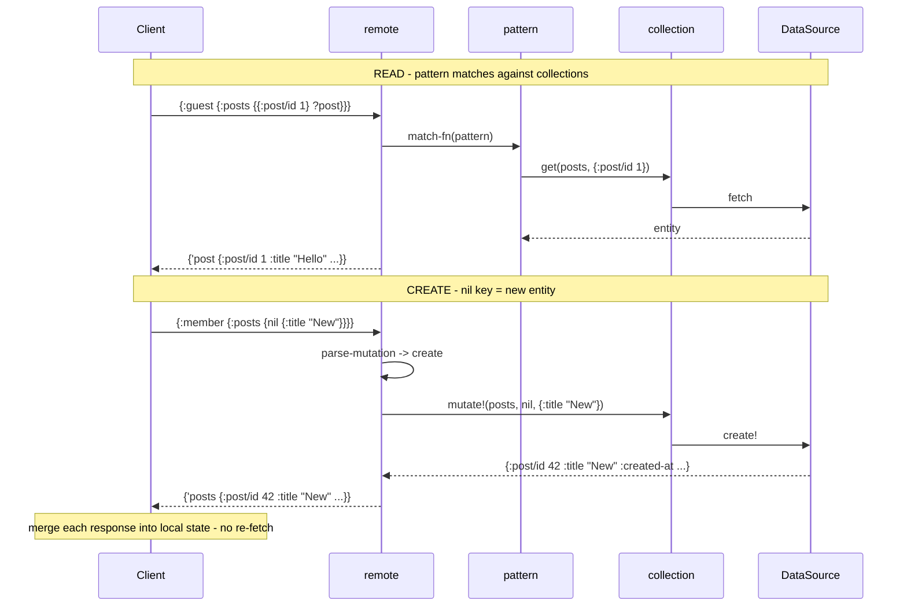

#  Lasagna Pattern

[](https://clojars.org/sg.flybot/lasagna-pattern)
[](https://clojars.org/sg.flybot/lasagna-collection)
[](https://clojars.org/sg.flybot/lasagna-remote)


Three composable Clojure/ClojureScript libraries that replace REST routes, GraphQL resolvers, and controller functions with a single pull-based API. Your client sends an EDN pattern describing what it wants. Your server is a data structure, not a set of handlers.

*Why "lasagna"? Three layers that stack: **pattern** matches your data, **collection** stores it, **remote** sends it over the wire. One endpoint. No route table. No controller layer.*

## Rationale

Traditional data access requires writing custom traversal code for each query shape. This toolbox provides a **declarative pattern language** inspired by [Datomic pull](https://docs.datomic.com/query/query-pull.html), but designed for Clojure data:

- **Patterns as data**: queries are EDN, not strings or macros
- **Unified syntax**: same pattern language for reads and writes (CRUD)
- **Local/remote parity**: same patterns work in-process and over HTTP
- **Composable**: build complex queries from simple primitives
- **Cross-platform**: works in Clojure and ClojureScript

**By design**: reads support partial success (one branch can fail without failing the request), writes are one mutation per request. No subscriptions/streaming.

## Try It

Explore the pattern syntax interactively at [pattern.flybot.sg](https://pattern.flybot.sg), no setup required. Write patterns, see results instantly, and work through progressively structured examples covering bindings, collections, sequences, constraints, and mutations.

Switch to **Remote mode** to pull live data from [flybot.sg](https://www.flybot.sg), the same patterns query real blog posts, demonstrating role-based access, schema validation, and autocomplete against a production API. You can also point it at your own pull-compatible server.

## Installation

Each component is published independently to Clojars:

```clojure
;; deps.edn - pick the layer you need
{:deps
 {sg.flybot/lasagna-pattern    {:mvn/version "RELEASE"}   ;; pattern only
  sg.flybot/lasagna-collection {:mvn/version "RELEASE"}   ;; + CRUD collections
  sg.flybot/lasagna-remote     {:mvn/version "RELEASE"}}} ;; + HTTP transport
```

| Artifact | What you get |
|----------|--------------|
| [`sg.flybot/lasagna-pattern`](https://clojars.org/sg.flybot/lasagna-pattern) | Core pattern DSL - matching and transforming data |
| [`sg.flybot/lasagna-collection`](https://clojars.org/sg.flybot/lasagna-collection) | CRUD abstraction with DataSource protocol |
| [`sg.flybot/lasagna-remote`](https://clojars.org/sg.flybot/lasagna-remote) | HTTP transport - includes pattern + collection |

## Three Composable Libraries

Each library is independent. Use one, two, or all three.

### pattern

Core DSL. Compiles EDN patterns into matcher functions. Works with maps, sequences, and any `ILookup` implementation (databases, APIs, lazy data sources). Cross-platform CLJ/CLJS.

```clojure
(require '[sg.flybot.pullable :refer [match-fn]])

;; Bind a value
((match-fn '{:name ?n} ?n) {:name "Alice"})  ;=> "Alice"

;; Map pattern - extract multiple values
((match-fn '{:name ?n :age ?a} [?n ?a]) {:name "Alice" :age 30})  ;=> ["Alice" 30]

;; Wildcard - match without binding
((match-fn '[?_ ?second] ?second) [1 2])  ;=> 2

;; Sequence with rest
((match-fn '[?first ?rest*] {:first ?first :rest ?rest}) [1 2 3])
;=> {:first 1, :rest (2 3)}

;; Constrained match
((match-fn '{:age (?a :when #(>= % 18))} ?a) {:age 25})  ;=> 25

;; Default on missing key
((match-fn '{:name (?n :default "Anonymous")} ?n) {})  ;=> "Anonymous"

;; Indexed lookup (any ILookup, e.g. a collection backed by a database)
((match-fn '{{:post/id 1} ?post} ?post) posts-collection)
;=> {:post/id 1 :post/title "Hello" ...}

;; Original input in body
((match-fn '{:a ?x} (assoc $ :sum ?x)) {:a 1 :b 2})  ;=> {:a 1 :b 2 :sum 1}
```

Variables, wildcards, optional/quantified matches, constraints (`:when`), defaults, and schema validation with Malli are all supported. The pattern language is expressive enough to handle complex queries while staying pure EDN.

See [pattern/README.md](./pattern/README.md) for the full syntax reference.

### collection

CRUD abstraction that makes your storage layer behave like native Clojure data. Implement the `DataSource` protocol (five methods: `fetch`, `list-all`, `create!`, `update!`, `delete!`), wrap it with `collection`, and you get `ILookup`, `Seqable`, `Counted`, `Mutable`, and `Wireable` for free.

The key design: **one DataSource, many access levels.** Instead of writing separate implementations per role, you compose thin decorators:

```clojure
(def posts (coll/collection (->PostsDataSource conn) {:id-key :post/id}))

(coll/read-only posts)                    ;; guest: no writes
(coll/wrap-mutable posts ownership-check) ;; member: ownership enforcement
posts                                     ;; admin: unrestricted
```

Each decorator overrides one concern. The underlying DataSource handles storage. Reads work through standard Clojure verbs (`get`, `seq`). The pattern engine does not know or care what is behind the `ILookup` interface.

See [collection/README.md](./collection/README.md) for the full protocol reference.

### remote

Ring middleware that receives EDN patterns over HTTP, detects reads vs writes, and routes accordingly. Reads go through `pattern` (compile + match). Writes go directly to `collection/mutate!`.

```clojure
;; Over HTTP (Ring middleware)
(def app
  (-> my-handler
      (remote/wrap-api my-api {:path "/api"})))

;; In-process (no HTTP, same patterns)
(def api-fn (fn [_ctx] {:data {:posts posts-coll}}))
(remote/execute api-fn '{:posts ?all})
;; => {'all [{:post/id 1 ...} {:post/id 2 ...}]}
```

Transit/EDN content negotiation, `$param` substitution, Malli schema validation, error detection with configurable HTTP status mapping, partial success for reads, and a schema introspection endpoint.

See [remote/README.md](./remote/README.md) for the full middleware reference.

## Architecture

READ and CREATE on a blog post at [flybot.sg](https://www.flybot.sg), same pattern syntax, different paths through the stack:


```mermaid
sequenceDiagram
    participant C as Client
    participant R as remote
    participant P as pattern
    participant Coll as collection
    participant DS as DataSource

    Note over C,DS: READ - pattern matches against collections
    C->>R: {:guest {:posts {{:post/id 1} ?post}}}
    R->>P: match-fn(pattern)
    P->>Coll: get(posts, {:post/id 1})
    Coll->>DS: fetch
    DS-->>P: entity
    R-->>C: {'post {:post/id 1 :title "Hello" ...}}

    Note over C,DS: CREATE - nil key = new entity
    C->>R: {:member {:posts {nil {:title "New"}}}}
    R->>R: parse-mutation -> create
    R->>Coll: mutate!(posts, nil, {:title "New"})
    Coll->>DS: create!
    DS-->>R: {:post/id 42 :title "New" :created-at ...}
    R-->>C: {'posts {:post/id 42 :title "New" ...}}

    Note over C: merge each response into local state - no re-fetch
```

UPDATE and DELETE follow the same pattern, see component READMEs for details.

**pattern** matches and binds data (READ path only). **collection** makes data mutable via `mutate!`. **remote** detects reads vs writes and routes accordingly. Mutation responses contain the full entity, used directly by the client without re-fetching.

Note: responses use **symbol keys** for variable bindings (e.g. `{'post {...}}`, not `{:post {...}}`). On the client side, use `(get response 'post)` to extract values.

## Structural Authorization

Because the API is just a map, authorization can be embedded in its shape rather than in a middleware chain. For example, [flybot.sg](https://www.flybot.sg) uses role names as top-level keys. Per-role guards produce data values (the branch's collections) or error sentinels, they don't intercept control flow:

```clojure
{:guest  {:posts guest-posts}
 :member (with-role session :member
           {:posts member-posts :me user-info})
 :admin  (with-role session :admin
           {:posts posts})
 :owner  (with-role session :owner
           {:users users})}
```

The `with-role` guard still exists: authorization conditionals have been relocated to data construction, not eliminated. But because each guard produces a value that becomes part of the response tree, the remote layer can return **partial success**: a single request can span multiple roles, and branches that fail return errors while successful branches return data.

```clojure
;; A client requests both public and authenticated data:
'{:guest {:posts ?all} :member {:me ?user}}

;; If the session lacks :member, the response contains:
;; - guest posts (success)
;; - an error for :member (forbidden)
;; No re-request needed for the public data.
```

This is something traditional middleware cannot do: middleware is all-or-nothing per request. Fine-grained concerns like ownership enforcement are handled at the collection level via `wrap-mutable` decorators, not at the structural level.

## Why not REST? Why not GraphQL?

In a typical Clojure web app, every API endpoint is a function: parse parameters, check authorization, call the database, transform the result, build a response. Each endpoint repeats this ceremony. Add a field? New endpoint. Change the shape? New version. REST gives you URLs for nouns but forces you to write verbs.

GraphQL improves on this with a query language, and the ecosystem is mature, with [Lacinia](https://github.com/walmartlabs/lacinia) providing solid Clojure support. But GraphQL's structural trade-offs remain: a type system that duplicates your Clojure specs, resolver functions for every field, a schema language that isn't EDN, and a runtime that sits between your data and your client.

| | REST | GraphQL | Lasagna Pattern |
|---|---|---|---|
| Query language | None (URLs + params) | Custom SDL | EDN (native Clojure data) |
| Schema | OpenAPI / Swagger | GraphQL SDL | Malli (optional) |
| Reads + writes | Separate verbs (GET/POST/PUT) | query vs mutation | Same pattern syntax |
| Resolvers | One per endpoint | One per field | None - collections are the API |
| Local/remote parity | No - different APIs | No - requires a server | Yes - same patterns in-process and over HTTP |
| Transport | HTTP conventions | HTTP POST + JSON | Ring middleware + Transit/EDN |
| Authorization | Middleware / guards | Resolver-level | Structural (shape of the data) |

## Heritage

This toolbox builds on a decade of pull-based query work at [Flybot](https://www.flybot.sg). The driving motivation: existing solutions (REST, GraphQL) are remote-only, local and remote calls require different APIs. We wanted a single interface that works in-process and over HTTP, using native Clojure data structures instead of a custom query language.

The early Pull API was read-only, requiring a separate `op` layer for mutations, a design flaw we aimed to eliminate. The goal was to unify reads and writes in the same pattern syntax, making Pull a viable alternative to GraphQL for data-driven APIs.

Lasagna Pattern is the latest generation of that work:

1. **[juxt/pull](https://github.com/juxt/pull)** (Malcolm Sparks). The starting point. [@robertluo](https://github.com/robertluo) contributed to the 0.2 version and used it in projects, but found its EQL-style syntax limited for deep and complex data structures: it returns a trimmed map, and users still need to walk the result to find specific values.
2. **[robertluo/pull](https://github.com/robertluo/pull)** (2016). A fork adding shadow attributes, wildcard support, stealth keys, and sequential map support. Inspired by [Datomic pull](https://docs.datomic.com/query/query-pull.html) and [EQL](https://edn-query-language.org/eql/1.0.0/what-is-eql.html).
3. **[lasagna-pull](https://github.com/flybot-sg/lasagna-pull)** (2020). A complete rewrite with an entirely new pattern syntax: named variables (`?x`), pattern options (`:when`, `:not-found`, `:with`, `:seq`), Malli schema validation, and cross-platform CLJ/CLJS support. [First public release](https://clojars.org/sg.flybot/lasagna-pull) in March 2023.
4. **[remote-pull](https://github.com/robertluo/remote-pull)** (2020). HTTP transport companion for lasagna-pull. Ring middleware with content negotiation (Transit/EDN), optional Malli validation, and SSE streaming. Read-only, no mutation support.
5. **Lasagna Pattern** (this toolbox). A complete rewrite that splits concerns into three independent libraries. The `pattern` component reimplements the DSL with `match-fn` and bidirectional patterns (same syntax for reads and writes). The `collection` component adds CRUD via the `DataSource` protocol. The `remote` component evolves remote-pull into a full read/write transport with mutation detection, partial success, errors-as-data, security sandboxing, parameter substitution, and schema introspection.

The core insight remains: *your data already has shape, your query language should match it*.

## Related Work

Several Clojure libraries work with nested data, but solve different problems:

- **[Specter](https://github.com/redplanetlabs/specter)** (Nathan Marz, 2015). Composable *navigators* for imperative traversal and transformation: "go here, do this." Excels at surgical in-place transforms but introduces its own DSL to learn. Pull patterns took a different approach: stay as close to natural EDN as possible while being more expressive than `select-keys` or `get-in`. Specter composes paths, pull pattern composes shapes.
- **[Meander](https://github.com/noprompt/meander)**. General-purpose term rewriting system. The surface similarity with pull patterns is a coincidence, Meander has a far broader scope (logical programming, term rewriting) where pull pattern is focused solely on data querying.

Lasagna Pattern is a declarative query language: "here is the shape of data I need." Patterns follow natural EDN, more expressive than `select-keys` or `get-in` but without a custom DSL to learn. The `remote` component extends the same patterns over HTTP, and `collection` makes mutations clean through a single `mutate!` interface.

## In Production

[flybot.sg](https://www.flybot.sg) is a full-stack Clojure blog built entirely on the toolbox. Google OAuth, Datahike storage, role-based access (guest, member, admin, owner), and a Replicant ClojureScript frontend, all through a single `/api` endpoint. The source is in this monorepo at [examples/flybot-site](./examples/flybot-site).

## Development

### Components

| Component | Description |
|-----------|-------------|
| [pattern](./pattern) | Core pattern DSL for matching and transforming data |
| [collection](./collection) | CRUD collection abstraction with DataSource protocol |
| [remote](./remote) | HTTP transport layer using pattern language |
| [flybot-site](./examples/flybot-site) | Production blog demonstrating pull pattern in web development |
| [pull-playground](./examples/pull-playground) | Interactive browser playground |

### Prerequisites

- [Babashka](https://github.com/babashka/babashka) (for task running)
- [Clojure CLI](https://clojure.org/guides/install_clojure) 1.11+
- Java 11+

### Quick Start

```bash
bb list                        # List all components
bb dev examples/flybot-site    # Start REPL for component
```

### Workspace Structure

```
lasagna-pattern/
├── pattern/              # Core pattern DSL
├── collection/           # CRUD collection abstraction
├── remote/               # HTTP transport layer
├── examples/
│   ├── flybot-site/      # Production blog example
│   └── pull-playground/  # Interactive playground
└── bb.edn                # Monorepo task runner
```

### Tasks

All tasks are run from the repository root.

| Task | Description |
|------|-------------|
| `bb list` | List all components |
| `bb rct` | Run RCT tests for **all** components |
| `bb rct <component>` | Run RCT tests for a specific component |
| `bb test` | Run Kaocha tests for **all** components (includes RCT + integration tests) |
| `bb test <component>` | Run Kaocha tests for a specific component |
| `bb dev <component>` | Start REPL with dev config |
| `bb nrepl <component>` | Start nREPL server |
| `bb clean` | Clean build artifacts for all components |
| `bb clean <component>` | Clean build artifacts for a specific component |
| `bb serve <component>` | Serve static UI (if component supports it) |
| `bb server <component>` | Start backend server (if component supports it) |

### Testing

Each component has **Rich Comment Tests (RCT)** embedded in source files. Some components also have **Kaocha test suites** that include RCT plus additional integration tests.

- `bb rct` - Fast feedback, runs only RCT assertions
- `bb test` - Full test suite via Kaocha (RCT + integration tests)

## License

[UNLICENSE](./UNLICENSE) - Public domain.
